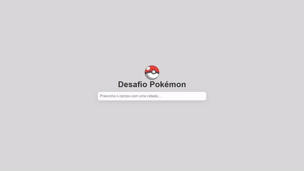

# Desafio Pokémon 🐱‍👤

✨Projeto criado com [React](https://github.com/facebook/create-react-app) e [axios API](https://github.com/axios/axios).✨

### Pré-requisitos

Tenha instalado: 
- Docker;
- Git Bash;
- Visual Studio

Para iniciar digite no terminal:
### `docker build -t pokemon-search .`

e por fim, para iniciar o projeto na porta 3000:
### `docker run --rm -p 3000:3000 pokemon-search`

## 👁Acesse [http://localhost:3000](http://localhost:3000) para ver!

